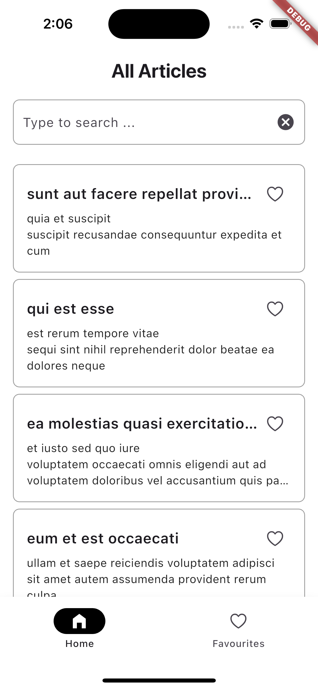
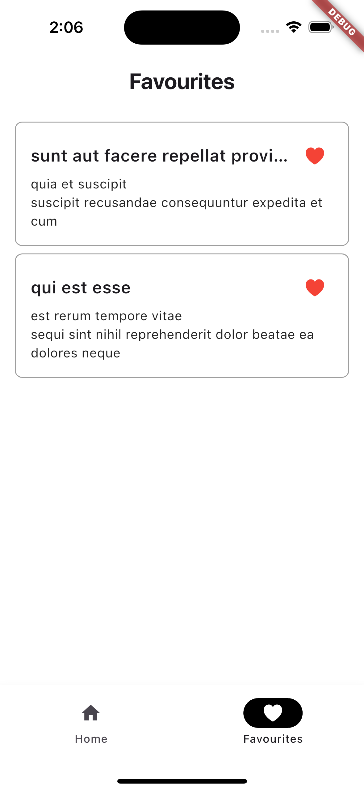
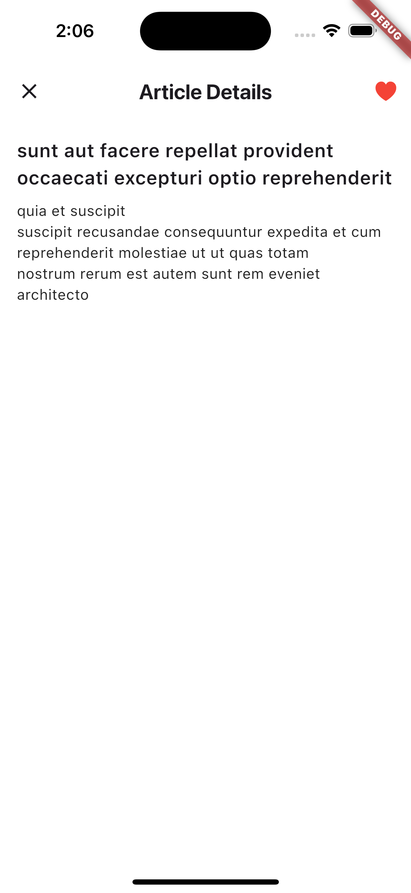

# bharat_nxt_assignment

# Flutter Article App
A Flutter app that fetches and displays a list of articles from a public
API.
## Features
- List of articles
- Search functionality
- Detail view
- Responsive UI
## Setup Instructions
1. Clone the repo:
git clone <your-repo-link>
cd flutter_article_app
2. Install dependencies:
flutter pub get
3. Run the app:
flutter run
## Tech Stack
- Flutter SDK: 3.27.1
- State Management: Provider
- HTTP Client: http
- Persistence: shared_preferences

## State Management Explanation
I chose provider because as the app is small and can be easily done in provider , also I have a good hnads on experience with provider.All the data is managed by provider.
## Known Issues / Limitations
We can implement the clear all favourites buttons
## Screenshots (Optional)
  
